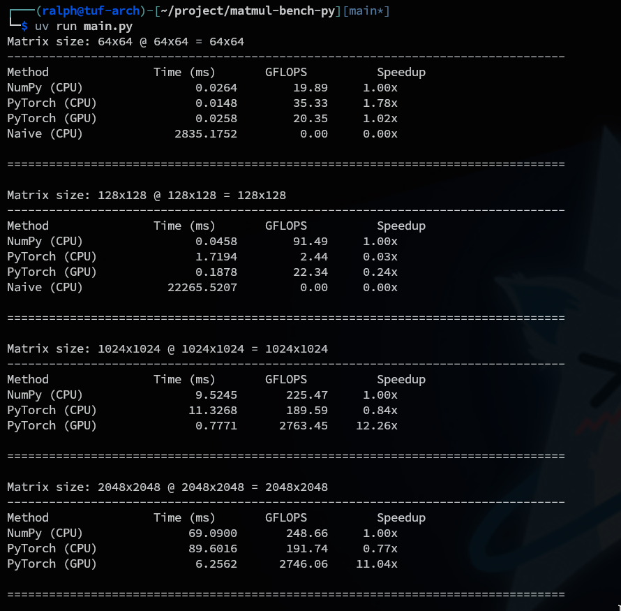

## Benchmark: Matrix Multiplication Performance Analysis

I benchmarked the following matrix multiplication operations:
- **Naive Python matmul** (CPU)
- **NumPy `.dot()`** (CPU)
- **PyTorch `.matmul()`** (CPU)
- **PyTorch `.matmul()`** (GPU)

### Experimental Setup
- **Matrix sizes tested**: 64, 128, 1024, 2048
- **Note**: Naive implementation only tested up to 128×128 (due to performance constraints)

### Benchmark Results

#### Matrix Size: 64×64
| Method | Time (ms) | GFLOPS | Speedup |
|--------|-----------|--------|---------|
| NumPy (CPU) | 0.0264 | 19.89 | 1.00× |
| PyTorch (CPU) | **0.0148** | **35.33** | **1.78×** |
| PyTorch (GPU) | 0.0258 | 20.35 | 1.02× |
| Naive (CPU) | 2835.1752 | 0.00 | 0.00× |

#### Matrix Size: 128×128
| Method | Time (ms) | GFLOPS | Speedup |
|--------|-----------|--------|---------|
| NumPy (CPU) | **0.0458** | **91.49** | **1.00×** |
| PyTorch (CPU) | 1.7194 | 2.44 | 0.03× |
| PyTorch (GPU) | 0.1878 | 22.34 | 0.24× |
| Naive (CPU) | 22265.5207 | 0.00 | 0.00× |

#### Matrix Size: 1024×1024
| Method | Time (ms) | GFLOPS | Speedup |
|--------|-----------|--------|---------|
| NumPy (CPU) | 9.5245 | 225.47 | 1.00× |
| PyTorch (CPU) | 11.3268 | 189.59 | 0.84× |
| PyTorch (GPU) | **0.7771** | **2763.45** | **12.26×** |

#### Matrix Size: 2048×2048
| Method | Time (ms) | GFLOPS | Speedup |
|--------|-----------|--------|---------|
| NumPy (CPU) | 69.0900 | 248.66 | 1.00× |
| PyTorch (CPU) | 89.6016 | 191.74 | 0.77× |
| PyTorch (GPU) | **6.2562** | **2746.06** | **11.04×** |

### Key Findings

**Small Matrices (64×64, 128×128)**:
- At **64×64**: PyTorch (CPU) is the fastest with 35.33 GFLOPS, even outperforming GPU (20.35 GFLOPS)
- At **128×128**: NumPy (CPU) dominates with 91.49 GFLOPS, while GPU achieves only 22.34 GFLOPS (0.24× speedup)
- GPU performance is hindered by kernel launch overhead

**Large Matrices (1024×1024, 2048×2048)**:
- GPU shows massive performance gains:
  - **12.26× speedup** at 1024×1024 (2763.45 GFLOPS)
  - **11.04× speedup** at 2048×2048 (2746.06 GFLOPS)
- PyTorch (CPU) performs worse than NumPy (CPU) at all sizes

### Analysis

#### 1. Why does CPU win for small matrices but GPU wins for large matrices?

**Kernel Launch Overhead**
- Launching a GPU kernel has a fixed cost (typically 5-50 microseconds) for:
  - Thread block creation and scheduling
  - GPU synchronization
  - Memory transfers between CPU and GPU
- For 64×64 and 128×128 matrices, the computation time is so small that kernel launch overhead dominates total execution time
- At these sizes, the CPU can complete the entire computation faster than the GPU can just set up the kernel

**Latency Hiding Through Parallelism**
- GPUs hide memory latency by maintaining thousands of threads ready to execute
- When one thread waits for data, the GPU immediately switches to another ready thread
- This parallelism only becomes beneficial when there's enough work to keep all threads busy
- For CPUs, more data = more waiting time, but GPUs scale better with data size

**The Crossover Point**
- Between 128×128 and 1024×1024, the computation workload becomes large enough that:
  - Kernel launch overhead becomes negligible compared to computation time
  - GPU's massive parallelism (thousands of cores) overwhelms CPU's sequential advantage
  - Memory bandwidth becomes the bottleneck, where GPU excels

**Analogy**: Think of CPU as a restaurant with 1 chef in a small, fast kitchen (quick for small orders, slow for large ones). GPU is like a restaurant with 1,000 chefs sharing a large pantry (slow startup for small orders due to coordination overhead, but massively parallel for large orders).

#### 2. Why is NumPy (CPU) faster than PyTorch (CPU)?

**NumPy**:
- Pure numerical computation library
- Minimal overhead
- Direct calls to highly optimized BLAS/LAPACK libraries (Intel MKL, OpenBLAS)
- Single-purpose design focused on raw computational efficiency
- No additional bookkeeping or metadata tracking

**PyTorch**:
- Designed for deep learning workflows, not just matrix operations
- Additional overhead from:
  - **Autograd system**: Maintains computation graph for automatic differentiation
  - **Tensor metadata**: Tracks gradients, device location, data type
  - **Framework abstraction**: Additional layers for flexibility and cross-platform support
- More generalized implementation to support:
  - GPU/CPU interoperability
  - Automatic gradient computation
  - Dynamic computational graphs

**Performance Impact**:
- At 64×64: PyTorch (CPU) is actually faster than NumPy (35.33 vs 19.89 GFLOPS), likely due to different optimization strategies for tiny matrices
- At larger sizes: NumPy's streamlined approach wins consistently
  - 128×128: NumPy is 37.5× faster
  - 1024×1024: NumPy is 19% faster
  - 2048×2048: NumPy is 30% faster

### Conclusion

For matrix multiplication:
- **Small matrices (< 256×256)**: Use NumPy (CPU) or PyTorch (CPU)
- **Large matrices (≥ 1024×1024)**: Use PyTorch (GPU) for 10-12× speedup
- **Never use**: Naive Python implementation for anything serious
- **Trade-off**: PyTorch's overhead is worth it when you need gradients or GPU acceleration for large-scale operations
